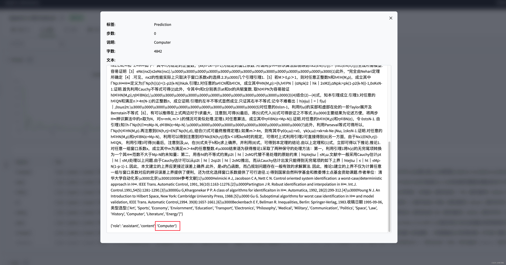

# Qwen2-1.5b-Instruct 微调 SwanLab可视化记录版

本节我们简要介绍基于 transformers、peft 等框架，使用Qwen2-1.5b-Instruct模型在**zh_cls_fudan-news** 上进行Lora微调训练，同时使用 [SwanLab](https://github.com/swanhubx/swanlab) 监控训练过程与评估模型效果。

参考工作：[Qwen2.5-7B-Instruct Lora 微调 SwanLab可视化记录版]（https://github.com/taurusduan/self-llm-AI/tree/master/models/Qwen2.5）
## 目录

- [环境配置](#-环境配置)
- [准备数据集](#-准备数据集)
- [模型可视化](#-模型可视化)
- [模型训练微调](#-模型训练微调)
- [推理模型）](#-推理模型)
- [训练结果演示](#-训练结果演示)
- [补充](#补充)


## 🌍 环境配置

环境配置分为三步：

1. 确保你的电脑上至少有一张英伟达显卡，并已安装好了CUDA环境。

2. 安装Python（版本>=3.8）以及能够调用CUDA加速的PyTorch。

3. 安装微调相关的第三方库，可以使用以下命令：

```bash
pip install swanlab modelscope transformers datasets peft pandas accelerate
```
## 准备数据集
本案例使用的是zh_cls_fudan-news数据集，该数据集主要被用于训练文本分类模型。

zh_cls_fudan-news由几千条数据，每条数据包含text、category、output三列：

text 是训练语料，内容是书籍或新闻的文本内容
category 是text的多个备选类型组成的列表
output 则是text唯一真实的类型

我们的训练任务，便是希望微调后的大模型能够根据Text和Category组成的提示词，预测出正确的Output。

文本分类任务-数据集下载：在[swift/zh_cls_fudan-news](https://modelscope.cn/datasets/swift/zh_cls_fudan-news/files)下载`train.jsonl`和`test.jsonl`到根目录下。

命名实体识别任务-数据集下载：在[qgyd2021/chinese_ner_sft](https://huggingface.co/datasets/qgyd2021/chinese_ner_sft/tree/main/data)下载`ccfbdci.jsonl`到根目录下。


在同一目录下，用以下代码处理数据集，得到新数据集文件：

```python
import json
def dataset_jsonl_transfer(origin_path, new_path):
    """
    将原始数据集转换为大模型微调所需数据格式的新数据集
    """
    messages = []

    # 读取旧的JSONL文件
    with open(origin_path, "r") as file:
        for line in file:
            # 解析每一行的json数据
            data = json.loads(line)
            context = data["text"]
            catagory = data["category"]
            label = data["output"]
            message = {
                "instruction": "你是一个文本分类领域的专家，你会接收到一段文本和几个潜在的分类选项，请输出文本内容的正确类型",
                "input": f"文本:{context},类型选型:{catagory}",
                "output": label,
            }
            messages.append(message)

    # 保存重构后的JSONL文件
    with open(new_path, "w", encoding="utf-8") as file:
        for message in messages:
            file.write(json.dumps(message, ensure_ascii=False) + "\n")
```
至此我们完成了数据集准备


## 模型可视化
使用SwanLab来监控整个训练过程，并评估最终的模型效果。

这里直接使用SwanLab和Transformers的集成来实现。

第一次使用SwanLab，请在用户设置页面复制你的API Key：（yFJtAXUnspSGfcN5nhHjy）


```python
from swanlab.integration.huggingface import SwanLabCallback


swanlab_callback = SwanLabCallback(...)

trainer = Trainer(
    ...
    callbacks=[swanlab_callback],
)

```

## 模型训练
这里我们使用modelscope下载Qwen2-1.5B-Instruct模型，然后把它加载到Transformers中进行训练：
| 模型       | 任务              | 运行命令                                                             | 
| ---------- | ----------------- | -------------------------------------------------------------------- | 
| Qwen2-1.5b | 指令微调-文本分类 | python train_qwen2.py | 
| Qwen2-1.5b    | 指令微调-命名实体识别 | python train_qwen2_ner.py | 


## 推理模型
训好的模型默认被保存在./output/Qwen2文件夹下。通过运行predict_qwen2.py文件，将微调后的qwen2模型进行推理，通过输入text和category，获得正确的output。其代码如下：
```python
import torch
from transformers import AutoModelForCausalLM, AutoTokenizer
from peft import PeftModel

def predict(messages, model, tokenizer):
    device = "cuda"

    text = tokenizer.apply_chat_template(messages, tokenize=False, add_generation_prompt=True)
    model_inputs = tokenizer([text], return_tensors="pt").to(device)

    generated_ids = model.generate(model_inputs.input_ids, max_new_tokens=512)
    generated_ids = [output_ids[len(input_ids):] for input_ids, output_ids in zip(model_inputs.input_ids, generated_ids)]
    response = tokenizer.batch_decode(generated_ids, skip_special_tokens=True)[0]

    return response


# 加载原下载路径的tokenizer和model
tokenizer = AutoTokenizer.from_pretrained("./qwen/Qwen2-1___5B-Instruct/", use_fast=False, trust_remote_code=True)
model = AutoModelForCausalLM.from_pretrained("./qwen/Qwen2-1___5B-Instruct/", device_map="auto", torch_dtype=torch.bfloat16)

# 加载训练好的Lora模型，将下面的checkpointXXX替换为实际的checkpoint文件名名称
model = PeftModel.from_pretrained(model, model_id="./output/Qwen2/checkpointXXX")

test_texts = {
    'instruction': "你是一个文本分类领域的专家，你会接收到一段文本和几个潜在的分类选项，请输出文本内容的正确类型",
    'input': "文本:航空动力学报JOURNAL OF AEROSPACE POWER1998年 第4期 No.4 1998科技期刊管路系统敷设的并行工程模型研究*陈志英*　*　马　枚北京航空航天大学【摘要】　提出了一种应用于并行工程模型转换研究的标号法，该法是将现行串行设计过程(As-is)转换为并行设计过程(To-be)。本文应用该法将发动机外部管路系统敷设过程模型进行了串并行转换，应用并行工程过程重构的手段，得到了管路敷设并行过程模型。"
}

instruction = test_texts['instruction']
input_value = test_texts['input']

messages = [
    {"role": "system", "content": f"{instruction}"},
    {"role": "user", "content": f"{input_value}"}
]

response = predict(messages, model, tokenizer)
print(response)


```


## 训练结果演示

可以看到在一些测试样例上，微调后的qwen2能够给出准确的文本类型：

